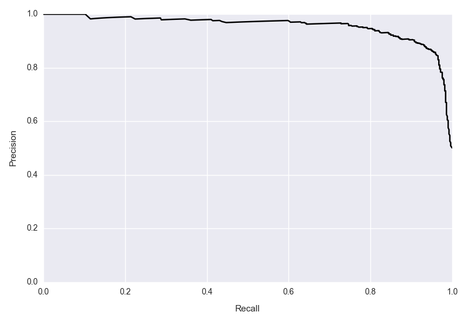
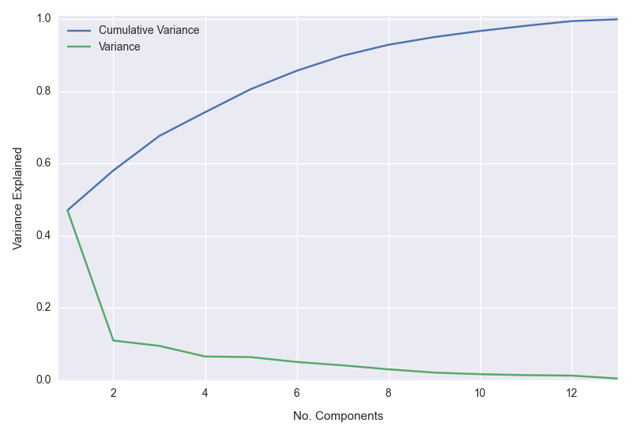

##Python tools

This repository hosts a collection of general functions that I regularly use in data analysis and classification problems in particular. The main focus is a set of Python tools for visualizing the performance of classification models in the presence of skewed or imbalanced classes (a.k.a., rare events problems), which are common in comparative and international politics research. 

####Separation Plot 

The separation plot shows the predicted probabilities of test observations in increasing order, with positive cases indicated by a vertical line. 

####Predicted Probabilities Plot 

The predicted probabilities plot demonstrates the estimated effect of one variable on the probability of an event. It superimposes the change in predicted probabilities across the covariate of interest on a histogram of the latter, allowing us to see how the probability of an event changes in substantively important ranges of the predictor variable.

####Precision-Recall Curve

In rare events problems, we are often concerned about how well we can predict the positive cases, and precision and recall are two metrics that speak directly to concern. The precision-recall curve plots the performance for these metrics across probability thresholds. 

####Confusion Plot 

The confusion plot allows us to visualize the confusion matrix for multiple classifiers simultaneously, allowing for quick visual comparison of model performance. The example below compares the performance of ridge, lasso, and random forest classifiers on the same test data. 

####Scree Plot

The scree plot shows the amount of variance explained by each of the principal components obtained from principal components analysis. The resulting plot shows cumulative variance explained alongside the variance for each component. The example below uses the Boston housing data. 

